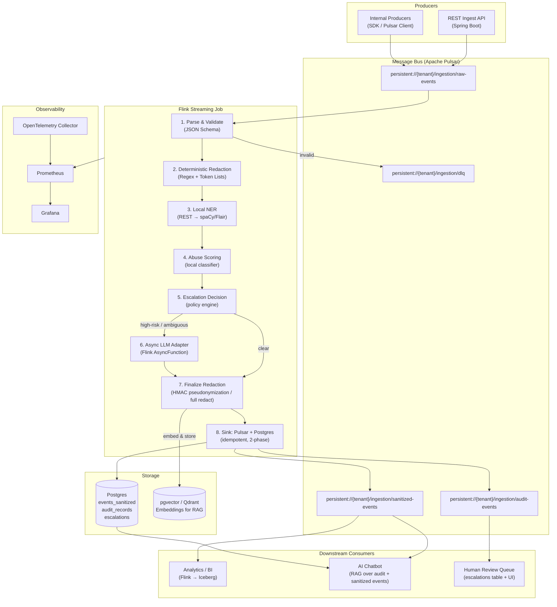

# Abuse & PII Filtering — Stream Ingestion Pipeline

> **Portfolio Project** · Java / Spring Boot · Apache Pulsar · Apache Flink · NER + LLM Adapter
>
> _Demonstrates: high-throughput streaming design, distributed systems engineering, AI/ML integration, compliance-grade security, and production observability — all strong talking points for senior backend & system-design interviews._

---

## Table of Contents

1. [Problem Statement & Motivation](#1-problem-statement--motivation)
2. [Use-Case Stories](#2-use-case-stories)
3. [Requirements](#3-requirements)
4. [Capacity Planning & SLOs](#4-capacity-planning--slos)
5. [High-Level Architecture](#5-high-level-architecture)
6. [Component Deep-Dives](#6-component-deep-dives)
   - 6.1 [Ingest API (Spring Boot)](#61-ingest-api-spring-boot)
   - 6.2 [Apache Pulsar — Message Bus](#62-apache-pulsar--message-bus)
   - 6.3 [Apache Flink — Stream Processing](#63-apache-flink--stream-processing)
   - 6.4 [NER Microservice](#64-ner-microservice)
   - 6.5 [Abuse Classifier](#65-abuse-classifier)
   - 6.6 [LLM Adapter](#66-llm-adapter)
   - 6.7 [Storage Layer](#67-storage-layer)
7. [Data Models](#7-data-models)
8. [Flink Job — Stage-by-Stage Design](#8-flink-job--stage-by-stage-design)
9. [Exactly-Once Semantics & Fault Tolerance](#9-exactly-once-semantics--fault-tolerance)
10. [Back-Pressure & Flow Control](#10-back-pressure--flow-control)
11. [Security Architecture](#11-security-architecture)
12. [Observability](#12-observability)
13. [Testing Strategy](#13-testing-strategy)
14. [Deployment & Infrastructure](#14-deployment--infrastructure)
15. [API Reference](#15-api-reference)
16. [Implementation Milestones](#16-implementation-milestones)
17. [Key Design Decisions & Trade-offs](#17-key-design-decisions--trade-offs)
18. [Interview Prep — Scenarios, Questions & Model Answers](#18-interview-prep--scenarios-questions--model-answers)

---

## 1. Problem Statement & Motivation

Modern platforms ingest millions of user-generated events per day — chat messages, comments, telemetry, support tickets. Buried inside this stream is:

- **Abusive content**: threats, hate speech, doxxing, coordinated harassment.
- **Sensitive PII**: emails, SSNs, credit-card numbers, passwords/tokens, IP addresses.
- **Regulatory risk**: GDPR Article 5 data-minimisation, CCPA, PCI-DSS scope creep.

**The Gap**: most teams push raw events into analytics lakes, creating a compliance time-bomb. Retroactive redaction is expensive and error-prone.

**What this system does**: intercepts the raw event stream _before_ it reaches any downstream consumer, applies a layered detection strategy (deterministic rules → local ML → optional LLM escalation), and emits only sanitized, auditable events downstream.

This project deliberately uses production-grade components (Pulsar for multi-topic pub-sub, Flink for stateful stream processing, RocksDB state backend) to simulate what you would build in a real team, not a toy demo.

---

## 2. Use-Case Stories

| Story                     | Actor                        | Trigger                                      | Outcome                                                                                                     |
| ------------------------- | ---------------------------- | -------------------------------------------- | ----------------------------------------------------------------------------------------------------------- |
| **A — Abuse Triage**      | Site Moderation Pipeline     | User comment contains a threat               | High-risk items flagged for human review, sanitized payload forwarded to analytics.                         |
| **B — Data Compliance**   | Telemetry / Analytics        | Telemetry stream contains credentials or PII | Fields redacted/pseudonymized before reaching data lake; audit trail retained for 7 years.                  |
| **C — Human-in-the-Loop** | Ambiguous multi-entity posts | NER confidence < threshold                   | Escalated to LLM adapter with minimised context; response stored with provenance; human moderator notified. |

---

## 3. Requirements

### 3.1 Functional

| ID  | Requirement                                                                                                      |
| --- | ---------------------------------------------------------------------------------------------------------------- |
| F-1 | Ingest raw events via `POST /api/v1/ingest` (REST/JSON) and `gRPC` (Protobuf) (≤ 200 KB payload).                |
| F-2 | Detect abuse categories: `TOXICITY`, `HATE_SPEECH`, `THREAT`, `DOXXING`, `SPAM`.                                 |
| F-3 | Detect PII types: emails, SSNs, credit cards, IPs, auth tokens, phone numbers, names (NER).                      |
| F-4 | Redaction modes configurable per `(tenant, service)`: `NONE` / `PARTIAL` (pseudonymize) / `FULL` (redact).       |
| F-5 | Every transformation recorded in an immutable audit trail: (actor, before_digest, after, confidence, timestamp). |
| F-6 | Ambiguous / high-risk events escalated to an LLM adapter via async I/O; pending events held in state.            |
| F-7 | Dead-letter queue (DLQ) for unprocessable events with error metadata.                                            |
| F-8 | Sanitized events available to downstream consumers (analytics, chatbot/RAG, human review).                       |

### 3.2 Non-Functional

| ID   | Requirement       | Target                                                                      |
| ---- | ----------------- | --------------------------------------------------------------------------- |
| NF-1 | **Latency**       | p50 < 200 ms, p99 < 1 s for deterministic path                              |
| NF-2 | **Throughput**    | 10 K events/sec per Flink task manager at baseline                          |
| NF-3 | **Durability**    | At-least-once delivery; exactly-once for sanitized sinks                    |
| NF-4 | **Availability**  | 99.9% uptime; no single point of failure                                    |
| NF-5 | **Security**      | Raw PII never leaves the system boundary; KMS-managed pseudonymization keys |
| NF-6 | **Observability** | Metrics, distributed traces, structured logs                                |
| NF-7 | **Cost**          | LLM calls capped by circuit breaker; configurable quota per tenant          |

---

## 4. Capacity Planning & SLOs

```
Baseline assumptions:
  - 10,000 events/sec peak ingestion rate
  - Average event size: 2 KB
  - ~5 % events trigger NER (mixed text payloads)
  - ~0.5% events escalate to LLM adapter

Network bandwidth (ingest):
  10,000 events/s × 2 KB = 20 MB/s inbound

Pulsar topic throughput:
  - {tenant}/raw-events:      20 MB/s  → 3 partitions, each ~7 MB/s
  - {tenant}/sanitized-events: ~18 MB/s (after redaction, slightly smaller)
  - {tenant}/audit-events:    ~2 MB/s (structured audit records, compact)
  - Retention:       24 h hot (BookKeeper), 7 days cold (tiered S3 offload)

Flink cluster sizing (baseline):
  - 2 Job Managers (HA with ZooKeeper leader election)
  - 4 Task Managers × 4 slots = 16 parallel operator slots
  - Checkpoint interval: 30 s; RocksDB incremental checkpoints to S3
  - Max parallelism: 16 (matches Pulsar partition count upper bound)

Postgres sizing:
  - events_sanitized: ~1.7 GB/day (2 KB × 10K/s × 86400 × 0.01 write rate; most events stream through)
  - audit_records:    ~500 MB/day
  - Partitioned by timestamp (monthly), archived to cold storage after 90 days

LLM adapter cost cap:
  - 0.5% of 10K events/s = 50 escalations/s (absolute upper bound, never reached in practice)
  - Circuit breaker: open if > 20 errors in 10 s; fallback to human queue
  - Per-tenant quota: max 500 LLM calls/minute
```

---

## 5. High-Level Architecture



---

## 6. Component Deep-Dives

### 6.1 Ingest API (Spring Boot)

**Technology**: Spring Boot 3.x + Spring Web + gRPC-Spring-Boot-Starter + `pulsar-client` Java SDK.

**Why support both REST and gRPC?**

- **REST (JSON):** Familiar to external clients, Web/Mobile, and allows low-barrier integration via simple HTTP POSTs.
- **gRPC (Protobuf / Apache Arrow IPC):** For high-throughput internal microservices. gRPC over HTTP/2 with binary Protobuf serialization drastically reduces CPU overhead and network bandwidth. Furthermore, gRPC endpoints can be structured to accept **Apache Arrow IPC** streams natively, avoiding JVM serialization overhead entirely.

**Key design choices:**

- **Fire-and-forget publish**: the handler publishes to Pulsar _asynchronously_ (`CompletableFuture`) and returns `202 Accepted` immediately — decoupling API latency from processing latency.
- **Producer pooling**: a single `PulsarClient` with a cached `Producer<byte[]>` per topic avoids connection churn under load.
- **Rate limiting**: Resilience4j `RateLimiter` annotation on the ingest endpoint (configurable per `X-Tenant-ID` header) to prevent a single tenant from flooding the topic.
- **Schema registry**: Pulsar's built-in Schema Registry enforces the `RawEvent` Avro or Protobuf schema at publish time — invalid payloads are rejected before they enter the pipeline.

```java
// Example: async publish in Spring Boot controller
@PostMapping("/api/v1/ingest")
public ResponseEntity<IngestResponse> ingest(
        @Valid @RequestBody RawEventRequest request,
        @RequestHeader("X-Tenant-ID") String tenantId) {

    RawEvent event = RawEvent.builder()
        .id(UUID.randomUUID().toString())
        .tenantId(tenantId)
        .timestamp(Instant.now())
        .rawPayload(request.getPayload())
        .metadata(request.getMetadata())
        .build();

    // Fire and forget; backpressure via Pulsar producer queue depth
    pulsarTemplate.sendAsync("raw-events", event)
        .exceptionally(ex -> { metricsRecorder.recordPublishError(); return null; });

    return ResponseEntity.accepted().body(new IngestResponse(event.getId()));
}
```

**Back-pressure hook**: if the Pulsar producer's `pendingQueueSize` exceeds a threshold, the endpoint returns `429 Too Many Requests` — preventing unbounded memory growth in the Spring process.

---

### 6.2 Apache Pulsar — Message Bus

**Why Pulsar over Kafka?**

| Feature              | Kafka                                | Pulsar                                                           |
| -------------------- | ------------------------------------ | ---------------------------------------------------------------- |
| Multi-tenancy        | Limited (manual topic naming)        | **Native**: `tenant/namespace` hierarchy                         |
| Resource Isolation   | SASL/ACLs only                       | **Physical isolation**: namespace-to-broker mapping policies     |
| Quotas               | Producer/Consumer rates (IP/Client)  | **Resource quotas**: storage limits, message rates per namespace |
| Storage architecture | Log on brokers (coupled)             | Compute–storage separation (BookKeeper)                          |
| Message retention    | Offset-based, fixed                  | Cursor-based; consumers advance independently                    |
| Geo-replication      | MirrorMaker (complex)                | Built-in cross-datacenter replication                            |
| Schema registry      | Confluent Schema Registry (separate) | Built-in                                                         |

**Topic design:**

| Topic                                              | Partitions | Retention          | Notes                         |
| -------------------------------------------------- | ---------- | ------------------ | ----------------------------- |
| `persistent://{tenant}/ingestion/raw-events`       | 16         | 24 h               | Matches max Flink parallelism |
| `persistent://{tenant}/ingestion/sanitized-events` | 16         | 7 days             | Downstream consumers          |
| `persistent://{tenant}/ingestion/audit-events`     | 4          | 7 days tiered → S3 | Compliance retention          |
| `persistent://{tenant}/ingestion/dlq`              | 4          | 30 days            | Ops investigation             |

**Subscription types in use:**

- `Failover` subscription on `raw-events` for the Flink job (single active consumer per partition — aligns with Flink source parallelism).
- `Shared` subscription on `sanitized-events` for analytics consumers (fan-out to multiple workers).

---

### 6.3 Apache Flink — Stream Processing

**Why Flink?**
Flink is the de-facto standard for stateful, low-latency stream processing at scale. Key differentiators over Spark Streaming:

- **True streaming**: event-by-event processing, not micro-batching.
- **State backends**: pluggable (heap, RocksDB); RocksDB enables large off-heap state without GC pauses.
- **Exactly-once**: two-phase commit sinks + checkpoints achieve end-to-end exactly-once.
- **Async I/O**: `AsyncDataStream` for non-blocking calls to NER and LLM adapter without stalling the pipeline.

**Job topology (operator graph):**

```
PulsarSource (1–16 parallel)
  └─ MapOperator: Parse & Validate          [parallelism=16]
       ├─ SideOutput(DLQ): invalid events   [→ DLQ sink]
       └─ MapOperator: Deterministic Redact (Regex + WASM) [parallelism=16, stateless]
            └─ AsyncOperator: NER call (Arrow Flight) [parallelism=8, unordered]
                 └─ MapOperator: Abuse Score (Embedded DJL) [parallelism=8]
                      └─ ProcessOperator: Escalation Decision
                           ├─ AsyncOperator: LLM Adapter [parallelism=4]
                           └─ MapOperator: Finalize Redaction [parallelism=8]
                                └─ TwoPhaseCommitSink:
                                     ├─ PulsarSink (sanitized-events)
                                     ├─ JdbcSink (Postgres)
                                     └─ IcebergSink (Parquet)
```

**Parallelism Strategy:**
NER and LLM calls are I/O-bound, so they run at lower parallelism with async buffering. CPU-bound operators (regex, WASM, embedded scoring) run at max parallelism.

**Tenant-Specific UDFs (WebAssembly):**
To support dynamic, tenant-level redaction logic without hardcoding rules into Flink or making slow HTTP calls, the deterministic redaction step embeds a **WASM Runtime** (e.g., Wasmtime via JNI or GraalWasm).

- Tenants can upload custom scrubber functions written in Rust/AssemblyScript, compiled to WASM.
- Flink executes these functions inline, safely sandboxed from the rest of the JVM, at near-native speeds.

---

### 6.4 NER Microservice (Apache Arrow Flight)

**Technology**: Python + FastAPI / Arrow Flight Server + spaCy `en_core_web_lg` (or Rust + Arrow).

**Why Arrow Flight instead of REST?**
A major bottleneck in calling a Python ML service from Java is serialization. Instead of REST/JSON (which requires converting objects to JSON strings, sending over HTTP, and parsing in Python), we use **Apache Arrow Flight**.

- **Zero-Copy Deserialization:** Flink batches events into an Apache Arrow in-memory columnar format and sends it via Arrow Flight (built on gRPC).
- The Python service receives the exact memory layout and reads it into Pandas/NumPy instantly without any deserialization overhead.

**Why a separate microservice at all?**

- ML model lifecycle is independent of the Flink job lifecycle.
- Isolating heavy GPU/Memory requirements natively rather than bridging them inside Flink.
- Python possesses the best-in-class NLP ecosystems (spaCy, Transformers).

**Endpoint design:**

```
POST /ner/detect
Body: { "text": "...", "context": { "tenant": "..." } }
Response: {
  "entities": [
    { "type": "PERSON", "start": 5, "end": 12, "text": "John Doe", "confidence": 0.97 },
    { "type": "EMAIL",  "start": 40, "end": 62, "text": "john@ex.com", "confidence": 1.0 }
  ],
  "latency_ms": 18
}
```

**Performance considerations:**

- Model loaded once at startup (not per-request).
- Batching: Flink's async operator collects up to 64 events before firing a batch NER request (reducing TCP overhead).
- Sidecar pattern in K8s: NER microservice deployed as a sidecar pod alongside Flink task managers — avoids cross-node network hops.

---

### 6.5 Abuse Classifier (Embedded ML)

**Strategy**: layered, from cheapest to most accurate:

1. **Token blocklist** (O(1) hash lookup) — catches obvious slurs and known patterns instantly.
2. **Regex patterns & WASM UDFs** — threats ("I will find you", "you're dead"), credential patterns, URL patterns, or tenant-specific logic.
3. **Embedded Fine-tuned DistilBERT (ONNX + DJL)** — high accuracy (~5 ms per event).
4. **LLM escalation** — only for genuinely ambiguous edge cases.

**Why Embedded ONNX via DJL?**
Instead of making an external network call for every event to calculate an abuse score, we load the ONNX version of our abuse model directly inside the Flink TaskManager's JVM memory.

- We use the **Deep Java Library (DJL)** natively in the Flink operator to run the inference.
- This entirely eliminates network hops, solving the "why not do this for NER too?" tradeoff: DistilBERT for raw classification converts perfectly to self-contained ONNX matrices, whereas NER often requires complex NLP tokenization pipelines (like spaCy) that are harder to embed purely in Java without complex JNI bridging.

### 6.6 LLM Adapter

**Responsibility**: classify ambiguous events and suggest redaction — without receiving raw PII.

**Safety contract** (enforced in code, not by policy):

```
Input to LLM = {
  structured_features: { abuse_score: 0.65, entities: ["PERSON×2", "URL×1"] },
  redacted_snippet: "I will find [PERSON_1], she lives near [LOC_1].",
  task: "classify abuse category and suggest redaction action"
}
// Raw payload NEVER appears in LLM input — enforced by type system
```

**Resilience patterns:**

- **Circuit breaker** (Resilience4j): trips after 5 consecutive failures → fallback to human queue.
- **Timeout**: 5 s per LLM call; configured via `CompletableFuture.orTimeout`.
- **Retry with backoff**: exponential backoff, max 2 retries, jitter to avoid thundering herd.
- **Token budget**: enforced per-tenant per-minute to control cost.
- **Provider abstraction**: `LlmAdapter` interface with `OpenAiAdapter`, `AnthropicAdapter`, `LocalOllamaAdapter` implementations — swappable via Spring `@ConditionalOnProperty`.

---

### 6.7 Storage Layer (Data Lakehouse)

**Apache Iceberg (Analytical Store):**
To avoid creating a "compliance time-bomb" in a generic S3 data lake, we use **Apache Iceberg** as our open table format.

- Iceberg provides ACID transactions, schema evolution, and hidden partitioning on top of our object store (S3/MinIO).
- Data is written as strongly-typed **Apache Parquet** files (optimized for on-disk compression and columnar querying).
- We use a **REST Catalog** (or **Project Nessie** for Git-like data versioning/branching) to manage the metadata. This allows Data Science teams to safely branch the sanitized event data, run experimental models, and merge results back.

**Postgres** (Operational / Metadata store):

- `events_sanitized_latest`: Used for recent, hot queries and point lookups via JSONB. (Older events are offloaded to Iceberg).
- `audit_records`: append-only, no UPDATE/DELETE allowed (enforced by row-level triggers).
- `escalations`: tracks LLM + human review lifecycle (status: `PENDING → IN_REVIEW → RESOLVED`).

**pgvector / Qdrant** (semantic search for chatbot):

- Sanitized event payloads are embedded (sentence-transformers) and stored as vectors.
- Enables the AI chatbot to answer: _"Find all incidents involving doxxing in the last 7 days"_ via semantic similarity search.

---

## 7. Data Models

### 7.1 Raw Event (Avro Schema / JSON representation)

```json
{
  "id": "a1b2c3d4-...",
  "timestamp": "2026-02-22T00:00:00Z",
  "tenantId": "acme-corp",
  "service": "comments-service",
  "raw_payload": "I'm going to find you, john.doe@example.com, and make you pay!",
  "metadata": {
    "source_ip": "1.2.3.4",
    "user_id": "u-123",
    "session_id": "s-456"
  }
}
```

### 7.2 Sanitized Event

```json
{
  "id": "a1b2c3d4-...",
  "timestamp": "2026-02-22T00:00:00Z",
  "tenantId": "acme-corp",
  "service": "comments-service",
  "sanitized_payload": "I'm going to find you, <EMAIL_REDACTED>, and make you pay!",
  "redaction_level": "PARTIAL",
  "abuse_category": "THREAT",
  "abuse_score": 0.91,
  "provenance": [
    {
      "step": "REGEX",
      "rule": "email_pattern_v2",
      "confidence": 1.0,
      "actor": "DeterministicRedactor"
    },
    {
      "step": "NER",
      "entity": "EMAIL",
      "confidence": 0.99,
      "actor": "SpacyNerService/v2.1"
    },
    {
      "step": "CLASSIFY",
      "model": "distilbert_abuse_v3",
      "confidence": 0.91,
      "actor": "AbuseClassifier"
    }
  ]
}
```

### 7.3 Audit Record

```json
{
  "audit_id": "b2c3d4e5-...",
  "event_id": "a1b2c3d4-...",
  "step": "REGEX",
  "before_digest": "sha256:abc...",
  "after_snippet": "... <EMAIL_REDACTED> ...",
  "actor": "DeterministicRedactor",
  "rule": "email_pattern_v2",
  "confidence": 1.0,
  "timestamp": "2026-02-22T00:00:01Z"
}
```

> **Note**: `before_digest` stores only a SHA-256 hash of the pre-redaction content (not the raw value) — ensuring the audit trail is tamper-evident without re-exposing PII.

### 7.4 Postgres DDL (abbreviated)

```sql
CREATE TABLE events_sanitized (
    id              UUID PRIMARY KEY,
    tenant_id       TEXT NOT NULL,
    service         TEXT NOT NULL,
    timestamp       TIMESTAMPTZ NOT NULL,
    sanitized_payload JSONB NOT NULL,
    redaction_level TEXT NOT NULL CHECK (redaction_level IN ('NONE','PARTIAL','FULL')),
    abuse_category  TEXT,
    abuse_score     NUMERIC(4,3),
    provenance      JSONB NOT NULL
) PARTITION BY RANGE (timestamp);

CREATE INDEX idx_events_sanitized_tenant  ON events_sanitized (tenant_id, timestamp DESC);
CREATE INDEX idx_events_sanitized_payload ON events_sanitized USING GIN (sanitized_payload);

CREATE TABLE audit_records (
    audit_id        UUID PRIMARY KEY DEFAULT gen_random_uuid(),
    event_id        UUID NOT NULL REFERENCES events_sanitized(id),
    step            TEXT NOT NULL,
    before_digest   TEXT NOT NULL,  -- SHA-256 of original snippet
    after_snippet   TEXT,
    actor           TEXT NOT NULL,
    confidence      NUMERIC(4,3),
    timestamp       TIMESTAMPTZ NOT NULL DEFAULT now()
) PARTITION BY RANGE (timestamp);

-- Prevent mutation of audit records (compliance requirement)
CREATE RULE no_update_audit AS ON UPDATE TO audit_records DO INSTEAD NOTHING;
CREATE RULE no_delete_audit AS ON DELETE TO audit_records DO INSTEAD NOTHING;

CREATE TABLE escalations (
    escalation_id   UUID PRIMARY KEY DEFAULT gen_random_uuid(),
    event_id        UUID NOT NULL REFERENCES events_sanitized(id),
    reason          TEXT NOT NULL,
    llm_input       JSONB,   -- redacted context sent to LLM
    llm_output      JSONB,   -- LLM classification result
    status          TEXT NOT NULL DEFAULT 'PENDING'
                    CHECK (status IN ('PENDING','IN_REVIEW','RESOLVED','AUTO_RESOLVED')),
    created_at      TIMESTAMPTZ NOT NULL DEFAULT now(),
    resolved_at     TIMESTAMPTZ,
    resolved_by     TEXT
);
```

---

## 8. Flink Job — Stage-by-Stage Design

### Stage 1: Source

```java
PulsarSource<RawEvent> source = PulsarSource.<RawEvent>builder()
    .setServiceUrl("pulsar://localhost:6650")
    .setAdminUrl("http://localhost:8080")
    .setTopics("persistent://public/default/raw-events")
    .setStartCursor(StartCursor.latest())
    .setDeserializationSchema(new AvroDeserializationSchema<>(RawEvent.class))
    .setSubscriptionName("flink-ingestion-job")
    .setSubscriptionType(SubscriptionType.Failover)
    .build();

StreamExecutionEnvironment env = StreamExecutionEnvironment.getExecutionEnvironment();
env.enableCheckpointing(30_000, CheckpointingMode.EXACTLY_ONCE);
env.getCheckpointConfig().setCheckpointStorage("s3://my-bucket/flink-checkpoints");
env.setStateBackend(new EmbeddedRocksDBStateBackend(true)); // incremental checkpoints
```

### Stage 2: Parse & Validate

```java
OutputTag<FailedEvent> DLQ_TAG = new OutputTag<>("dlq", TypeInformation.of(FailedEvent.class));

SingleOutputStreamOperator<RawEvent> parsed = rawStream
    .process(new ParseAndValidateFunction(DLQ_TAG))
    .name("parse-validate");

DataStream<FailedEvent> dlqStream = parsed.getSideOutput(DLQ_TAG);
// dlqStream → PulsarSink(dlq topic)
```

### Stage 3: Deterministic Redaction

- Stateless `MapFunction` — compiled regex patterns loaded once (not per-event).
- Patterns: email, credit card (Luhn), SSN, API keys/tokens (entropy-based detection), IPv4/IPv6.
- Emits `provenance` entries for each match.

### Stage 4: Async NER Call

```java
DataStream<NerEnrichedEvent> nerEnriched = AsyncDataStream.unorderedWait(
    deterministicRedacted,
    new NerAsyncFunction(nerServiceUrl, batchSize=64),
    5000, TimeUnit.MILLISECONDS,   // timeout
    100                             // max in-flight requests
).name("ner-enrichment");
```

**Unordered** mode chosen: NER enrichment has no ordering dependency; unordered gives higher throughput.

### Stage 5: Abuse Scoring

- ONNX Runtime Java API: loads `abuse_model.onnx` once per task manager.
- Input: tokenized text features + NER entity types.
- Output: `{ abuse_category, abuse_score }`.

### Stage 6: Escalation Decision

```java
public class EscalationDecisionFunction extends KeyedProcessFunction<String, ScoredEvent, ProcessedEvent> {
    // Key by tenantId — per-tenant policy state
    private ValueState<TenantPolicy> policyState;

    @Override
    public void processElement(ScoredEvent event, Context ctx, Collector<ProcessedEvent> out) {
        TenantPolicy policy = policyState.value();
        double threshold = policy.getEscalationThreshold(); // loaded from Flink Broadcast State

        if (event.getAbuseScore() > threshold || event.isNerAmbiguous()) {
            ctx.output(ESCALATION_TAG, event);  // → async LLM path
        } else {
            out.collect(event.asProcessed());   // → direct finalization
        }
    }
}
```

**Policy as Broadcast State**: tenant-level policies (thresholds, redaction mode) stored in Flink's `BroadcastState` fed by a slow-moving Pulsar source. Allows runtime policy changes without job restarts.

### Stage 7: Async LLM Adapter

```java
DataStream<ProcessedEvent> llmEnriched = AsyncDataStream.orderedWait(
    escalationStream,
    new LlmAdapterAsyncFunction(llmAdapter, circuitBreaker),
    5000, TimeUnit.MILLISECONDS,
    20   // max in-flight LLM calls (cost control)
).name("llm-escalation");
```

**Ordered** mode for LLM: ensures audit trail order is preserved for human review consistency.

### Stage 8: Finalize Redaction

Apply pseudonymization: `HMAC-SHA256(tenantSalt, entityValue)` truncated to 12 chars — stable across events (same entity → same pseudonym within a tenant), irreversible without the salt (stored in KMS, not in Flink state).

### Stage 9: Sinks (Exactly-Once)

```java
// Two-phase commit sink for Postgres (Hot store)
FlinkSink.<ProcessedEvent>builder()
    .withRowDataType(ProcessedEvent.class)
    .withJdbcUrl(jdbcUrl)
    .withSql("INSERT INTO events_sanitized (...) VALUES (?) ON CONFLICT (id) DO NOTHING")
    .build();

// Pulsar sink — transactional producer (Downstream real-time consumers)
PulsarSink<ProcessedEvent> pulsarSink = PulsarSink.<ProcessedEvent>builder()
    .setServiceUrl(pulsarUrl)
    .setTopic("persistent://public/default/sanitized-events")
    .setSerializationSchema(new AvroSerializationSchema<>(ProcessedEvent.class))
    .setDeliveryGuarantee(DeliveryGuarantee.EXACTLY_ONCE)
    .build();

// Iceberg sink — Analytical Lakehouse
IcebergSink.Builder<ProcessedEvent> icebergSink = IcebergSink.forRowData(processedEventStream)
    .tableLoader(TableLoader.fromCatalog(catalogLoader, TableIdentifier.of("security", "sanitized_events")))
    .append();
```

---

## 9. Exactly-Once Semantics & Fault Tolerance

This is one of the most commonly asked streaming system design topics in interviews. Here is how it is achieved end-to-end:

```
Producer (Spring Boot)    Pulsar         Flink Job            Postgres / Pulsar Sink
─────────────────────     ──────         ─────────            ──────────────────────
 idempotent publish ──>   durable  ──>   checkpoint ──>       two-phase commit
 (messageId dedup)        storage        (RocksDB)            (TxnCoordinator)
```

**Phases:**

1. **Checkpoint starts**: Flink injects a barrier into the stream; each operator snapshots its state to RocksDB → S3.
2. **Pre-commit**: Flink's two-phase commit sink flushes buffered events to Postgres/Pulsar in a transaction but does not commit.
3. **Checkpoint completes**: all operators acknowledge the barrier.
4. **Commit**: sink commits the transaction; events visible to downstream consumers.
5. **Failure**: if the job crashes after pre-commit but before commit, on restart Flink re-plays from the last checkpoint and the sink's idempotent upsert (`ON CONFLICT DO NOTHING`) prevents duplicates.

**At-Least-Once boundary**: the NER and LLM async calls are at-least-once (external services have no Flink transaction integration). Idempotency is enforced by deduplicating on `event_id` in the finalization stage.

---

## 10. Back-Pressure & Flow Control

```
Pulsar Producer (Spring Boot)
   └─ Producer pending queue (max 1000 msgs) ← backpressure signal
        └─ If full → REST endpoint returns 429

Flink Flink pipeline
   └─ Credit-based flow control (Netty network buffers between operators)
        └─ If downstream operator is slow → upstream operator naturally slows (no separate mechanism needed)
             └─ Pulsar consumer credit decreases → Pulsar broker stops pushing messages
                  └─ BookKeeper holds messages safely until consumer catches up
```

**Key insight**: Flink's credit-based flow control propagates back-pressure from slow sinks all the way to the Pulsar source automatically — no polling loops or external rate limiters needed within the pipeline.

**NER/LLM back-pressure**: managed by `maxConcurrentRequests` in `AsyncDataStream` — if all slots are busy, the upstream pauses (Flink's async operator blocks internally using a queue bounded by `capacity`).

---

## 11. Security Architecture

### 11.1 PII Data Lifecycle

```
Raw PII appears only in:
  1. Pulsar raw-events topic (retained 24 h, then deleted)
  2. Flink in-memory operator state (never checkpointed — raw_payload excluded from state)

PII is pseudonymized/redacted BEFORE:
  - Postgres writes
  - LLM adapter calls
  - Pulsar sanitized-events topic
  - Logs and traces
```

### 11.2 Pseudonymization Scheme

```
pseudonym = Base64URL( HMAC-SHA256( KMS-key[tenantId], entityValue ) )[:12]

Properties:
  - Deterministic: same entity → same pseudonym in same tenant (enables cross-event correlation)
  - Irreversible: without KMS key, pseudonym cannot be reversed (HMAC, not encryption)
  - Tenant-isolated: different salt per tenant prevents cross-tenant correlation
  - Revocable: rotate/delete KMS key → pseudonym becomes permanently unresolvable (GDPR right-to-erasure)
```

### 11.3 Threat Model

| Threat                          | Mitigation                                                                                    |
| ------------------------------- | --------------------------------------------------------------------------------------------- |
| Raw PII leaks to LLM provider   | LLM adapter type-safe input contract; raw_payload field never passed through                  |
| Pulsar topic eavesdropping      | Pulsar TLS + token-based authentication (mTLS in production)                                  |
| Audit trail tampering           | Postgres rules prevent UPDATE/DELETE; before_digest is a hash                                 |
| KMS key compromise              | Key rotation; envelope encryption (DEK wrapped by KMS master key)                             |
| False negatives (missed PII)    | Defense in depth: regex → NER → LLM; accept some false negatives, rely on audit for discovery |
| Over-redaction (analytics loss) | `PARTIAL` pseudonymization preserves analytical value while hiding raw values                 |
| Replay attacks on ingest API    | Idempotency key (`event_id`) + deduplication window in Flink                                  |

---

## 12. Observability

### 12.1 Metrics (Prometheus)

```
# Throughput
ingestion_events_total{tenant, service, status}          counter
ingestion_dlq_total{tenant, reason}                      counter

# Detection
pii_detections_total{type, actor}                        counter
abuse_detections_total{category, score_bucket}           counter
escalation_total{reason, outcome}                        counter

# Latency (histograms with p50/p95/p99 buckets)
ingestion_e2e_latency_seconds{stage}                     histogram
ner_request_latency_seconds                              histogram
llm_request_latency_seconds                              histogram

# Cost control
llm_tokens_consumed_total{tenant, provider}              counter
llm_circuit_breaker_state{provider}                      gauge

# Flink internals (exposed via Flink's Prometheus reporter)
flink_jobmanager_job_numRestarts                         gauge
flink_taskmanager_job_task_checkpointAlignmentTime       histogram
flink_taskmanager_job_task_currentInputWatermark         gauge
```

### 12.2 Distributed Tracing (OpenTelemetry)

Trace propagation: `W3C TraceContext` header injected by Spring Boot → propagated as Pulsar message property → picked up by Flink source → forwarded to NER and LLM adapter calls.

Each event gets a root span `ingest_event` with child spans:

- `parse_validate`
- `deterministic_redact`
- `ner_detect`
- `abuse_score`
- `llm_escalate` (if triggered)
- `finalize_redact`
- `sink_write`

### 12.3 Structured Logging

All operators emit JSON logs with `event_id`, `tenant_id`, `stage`, and `duration_ms` — no raw PII ever logged. Log levels: INFO for normal flow, WARN for DLQ, ERROR for exceptions.

---

## 13. Testing Strategy

### 13.1 Unit Tests (JUnit 5 + Mockito)

- Regex pattern accuracy: parameterized tests across a labelled dataset (200+ samples).
- HMAC pseudonymization: determinism, tenant isolation, format compliance.
- Escalation policy logic: boundary conditions around score thresholds.
- LLM adapter: mock HTTP server (WireMock) for circuit-breaker and timeout scenarios.

### 13.2 Flink Integration Tests (MiniCluster + Testcontainers)

```java
@Test
void givenEmailInPayload_shouldRedactAndProduceAuditRecord() {
    // Arrange: start Flink MiniCluster + Testcontainers Postgres + Pulsar
    // Act: publish raw event with email in payload
    // Assert:
    //   - sanitized-events topic contains <EMAIL_REDACTED>
    //   - audit_records table has 1 row for this event_id
    //   - events_sanitized.provenance contains REGEX step
}
```

Test coverage targets:

- Happy path: each PII type detected and redacted.
- DLQ path: malformed JSON, oversized payload.
- Escalation path: high abuse score routes to LLM mock.
- Fault tolerance: simulate checkpoint failure, assert no duplicate events in sink.

### 13.3 E2E Tests

- Mock LLM adapter (WireMock) returns deterministic outputs.
- Full pipeline from REST `POST /ingest` → Pulsar → Flink → Postgres → assert DB state.
- Performance test: JMeter or Gatling load test at 1K events/sec; assert p99 < 1 s.

### 13.4 Model Quality Tests

- Maintain a **labelled dataset** (500+ messages) with known PII / abuse ground truth.
- CI gate: precision ≥ 0.95, recall ≥ 0.90 for PII detection; abuse classifier F1 ≥ 0.85.
- Run nightly; alert if model drift detected.

---

## 14. Deployment & Infrastructure

### 14.1 Docker Compose (Local Dev)

```yaml
services:
  pulsar:
    image: apachepulsar/pulsar:3.1.0
    command: bin/pulsar standalone
    ports: ["6650:6650", "8080:8080"]

  flink-jobmanager:
    image: apache/flink:1.19-java17
    command: jobmanager
    environment:
      - FLINK_PROPERTIES=jobmanager.rpc.address:flink-jobmanager

  flink-taskmanager:
    image: apache/flink:1.19-java17
    command: taskmanager
    depends_on: [flink-jobmanager]

  postgres:
    image: pgvector/pgvector:pg16
    environment:
      POSTGRES_DB: ingestion_pipeline
      POSTGRES_PASSWORD: secret

  ner-service:
    build: ./ner-service
    ports: ["8001:8001"]

  prometheus:
    image: prom/prometheus:v2.48.0
    volumes: ["./prometheus.yml:/etc/prometheus/prometheus.yml"]

  grafana:
    image: grafana/grafana:10.2.0
    ports: ["3000:3000"]
```

### 14.2 Production Architecture (K8s)

- **Pulsar**: Helm chart (`apache/pulsar`), 3 brokers, 3 bookies, ZooKeeper quorum.
- **Flink**: Flink Kubernetes Operator (native K8s mode); `FlinkDeployment` CRD.
- **NER service**: Deployment with HPA (CPU-based autoscaling), 2–10 replicas.
- **Postgres**: AWS RDS for PostgreSQL (Multi-AZ) or CloudNativePG operator on K8s.
- **KMS**: AWS KMS or HashiCorp Vault for pseudonymization salt storage.
- **Secrets**: Kubernetes Secrets + External Secrets Operator (synced from Vault).

---

## 15. API Reference

### `POST /api/v1/ingest`

Publishes a raw event to the pipeline.

**Request:**

```json
{
  "payload": "string (raw text or JSON payload, max 200 KB)",
  "metadata": {
    "source_ip": "string",
    "user_id": "string",
    "session_id": "string"
  }
}
```

**Headers:** `X-Tenant-ID: string` (required), `X-Idempotency-Key: uuid` (optional)

**Responses:**

- `202 Accepted` — `{ "event_id": "uuid", "status": "accepted" }`
- `400 Bad Request` — payload validation error
- `429 Too Many Requests` — rate limit exceeded
- `503 Service Unavailable` — Pulsar producer queue full

### `GET /api/v1/events/{id}/audit`

Returns all audit records for an event.

**Response:**

```json
{
  "event_id": "uuid",
  "audit_records": [
    {
      "step": "REGEX",
      "actor": "DeterministicRedactor",
      "confidence": 1.0,
      "timestamp": "..."
    }
  ]
}
```

### `GET /api/v1/events/{id}`

Returns the sanitized event.

### `GET /api/v1/escalations?status=PENDING&tenant=acme`

Lists escalations for human review.

### `PATCH /api/v1/escalations/{id}`

Resolve an escalation (human review outcome).

**Body:** `{ "resolution": "APPROVED|REJECTED", "notes": "string" }`

---

## 16. Implementation Milestones

| Phase       | Duration | Deliverables                                                                                                               |
| ----------- | -------- | -------------------------------------------------------------------------------------------------------------------------- |
| **MVP**     | 4–7 days | Spring Boot ingest API → Pulsar → Flink job (deterministic redaction only) → Postgres sink → Grafana metrics dashboard     |
| **Phase 2** | 5–8 days | NER microservice integration (Flink async I/O); DLQ; audit table with immutability rules; Testcontainers integration tests |
| **Phase 3** | 3–5 days | Abuse classifier (ONNX); escalation policy engine (Broadcast State); mocked LLM adapter; provenance in every event         |
| **Phase 4** | 3–6 days | Real LLM adapter with circuit breaker; KMS pseudonymization; pgvector embeddings; human review API; perf load test         |
| **Phase 5** | 2–4 days | Docker Compose dev stack fully wired; README + demo script; architecture diagram finalized; CI pipeline (GitHub Actions)   |

---

## 17. Key Design Decisions & Trade-offs

| Decision           | Chosen                 | Alternative                             | Why                                                                                                                           |
| ------------------ | ---------------------- | --------------------------------------- | ----------------------------------------------------------------------------------------------------------------------------- |
| Message bus        | Apache Pulsar          | Apache Kafka                            | Multi-tenancy, built-in schema registry, compute–storage separation, tiered storage — better for a multi-tenant SaaS product  |
| Stream engine      | Apache Flink           | Spark Structured Streaming              | True streaming (not micro-batch), richer state APIs, Async I/O operator, better exactly-once story                            |
| NER delivery       | Sidecar microservice   | In-process (JNI/GraalVM)                | Independent deployment, language flexibility (Python ML ecosystem), easier testing                                            |
| Abuse model        | ONNX in-process        | Remote inference service                | Eliminates network hop for fast path; ONNX supports Java SDK                                                                  |
| Pseudonymization   | HMAC-SHA256 + KMS salt | AES encryption                          | HMAC is irreversible (right-to-erasure by key deletion), deterministic (cross-event correlation), no IV management complexity |
| Audit immutability | Postgres rules         | Separate append-only log (Kafka/Pulsar) | Simplifies query; foreign keys to events_sanitized; rules prevent accidental mutation                                         |
| LLM isolation      | Redacted context only  | Full payload                            | PII safety is non-negotiable; structured features + redacted snippet are sufficient for abuse classification                  |
| State backend      | RocksDB                | In-memory (heap)                        | RocksDB handles state larger than JVM heap; incremental checkpoints; required for production throughput                       |

---

## 18. Interview Prep — Scenarios, Questions & Model Answers

> This section is structured for active interview preparation. Each block contains a scenario, likely interview questions, and model answer talking points.

---

### 18.1 "Walk me through your streaming pipeline design."

**Talking points (STAR format):**

**Situation**: Real-time ingestion of user content at scale with compliance and safety requirements.

**Task**: Design a pipeline that detects PII and abuse _before_ data reaches any analytics system, with an auditable trail.

**Action** (sequence to narrate):

1. Start with the source: _"Spring Boot REST API publishes events to Apache Pulsar — fire-and-forget async publish, 202 Accepted, decoupled from processing latency."_
2. Message bus: _"Pulsar's compute–storage separation means I can scale brokers and storage independently. BookKeeper retains raw events for 24 hours — enough for consumer lag recovery without infinite storage."_
3. Flink job stages: walk through the operator graph (parse → regex → NER → score → escalate → redact → sink). Emphasize the layering: cheap deterministic rules first, expensive ML last.
4. Sinks: _"Two-phase commit between Flink checkpoints + Postgres transactions gives exactly-once semantics end-to-end."_
5. Observability: mention the OpenTelemetry trace propagated from the REST call through Pulsar → Flink → NER → LLM.

---

### 18.2 "How do you guarantee exactly-once in a distributed streaming system?"

**Key concepts to hit:**

- **Idempotent producers**: Pulsar's producer-side deduplication by `sequenceId` prevents broker-side duplicates on retry.
- **Checkpoints**: Flink snapshots operator state (RocksDB) + consumer offsets atomically. On recovery, the job replays from the checkpoint cursor — all partially processed events are re-processed.
- **Two-phase commit sinks**: Flink's `TwoPhaseCommitSinkFunction` coordinates checkpoint completion with the sink's transaction commit. Pre-commit on checkpoint barrier; full commit only after all operators acknowledge the checkpoint.
- **Idempotent writes**: `ON CONFLICT DO NOTHING` in Postgres + idempotent Pulsar producers ensure re-played events don't create duplicates even if the commit was partially visible.
- **At-least-once boundary**: the NER/LLM calls are at-least-once (external services). Deduplication on `event_id` in the finalization stage absorbs this.

**Common follow-up**: _"What happens if the Flink job crashes after writing to Postgres but before committing the Pulsar sink?"_
Answer: The two-phase commit is coordinated — both sinks are in the same Flink checkpoint epoch. If one fails, both roll back. On restart, Flink re-plays from the last fully committed checkpoint and re-writes the events (idempotent upsert handles this).

---

### 18.3 "How do you handle back-pressure?"

**Multi-layer answer:**

1. **REST → Pulsar**: Pulsar producer has a bounded pending queue. If full, the Spring Boot endpoint returns `429` — client-side back-pressure.
2. **Pulsar → Flink**: Pulsar's consumer uses flow control credits. Flink source decreases credits when its internal input buffer fills up — Pulsar broker stops pushing new messages.
3. **Within Flink**: credit-based flow control between Netty buffers of adjacent operators. A slow downstream operator causes buffers to fill → upstream operator slows naturally without any configuration.
4. **Async operators**: `AsyncDataStream` has a bounded `capacity` parameter. When all async slots are full, the upstream operator pauses.
5. **LLM adapter**: max in-flight requests + circuit breaker + per-tenant quota as cost control.

**Interviewer follow-up**: _"How would you detect that back-pressure is happening?"_
Answer: Flink's web UI shows operator back-pressure indicators. Prometheus metric `flink_taskmanager_job_task_backPressuredTimeMsPerSecond` shows time each operator is back-pressured. Alert when this exceeds, say, 100 ms/s sustained.

---

### 18.4 "How does the AI/ML layer work, and why not just use OpenAI for everything?"

**Framework to answer:**

1. **Privacy constraint**: _"We can't send raw PII to a third-party LLM — GDPR, CCPA. So 90%+ of detection must happen on-prem."_
2. **Cost and latency**: _"LLM API calls are 100–500 ms and cost money per token. We use them only for the ~0.5% of events that are genuinely ambiguous after cheaper detectors."_
3. **Layered strategy**: token blocklist (O(1)) → regex → local lightweight ML (ONNX, ~5 ms) → local NER (spaCy, ~20 ms) → LLM adapter (500 ms, rate-limited). Each layer is progressively more accurate and more expensive.
4. **Safety contract on LLM calls**: _"The LLM adapter has a type-safe input contract that physically cannot receive the raw_payload field. It receives structured features and a pre-redacted snippet."_
5. **Model serving via ONNX**: _"ONNX Runtime Java SDK loads the model once per Flink task manager. No network hop for the fast path — critical for p99 latency."_

---

### 18.5 "How do you design for multi-tenancy?"

**Key points:**

1. **Pulsar Native Hierarchy**: `persistent://{tenant}/{namespace}/raw-events`. This allows tenant isolation at the broker level.
2. **Namespace Isolation Policies**: Using Pulsar's `NamespaceIsolationPolicy`, we can pin specific high-value tenants to a subset of brokers (Isolation Groups). This prevents a "noisy neighbor" on Tenant A from impacting the Flink job's tail latency for Tenant B.
3. **Storage & Message Quotas**: Enforced at the Pulsar Namespace level (e.g., max 50GB backlog for Tenant A). This provides hard back-pressure that doesn't rely on the Flink job's health.
4. **Broadcast State in Flink**: Tenant policy (redaction mode, escalation threshold, LLM quota) stored in Flink `BroadcastState`.
5. **Per-tenant pseudonymization keys**: each tenant has its own KMS key for HMAC salts — cross-tenant pseudonym correlation is impossible by construction.
6. **Rate limiting**: Resilience4j limiter keyed on `X-Tenant-ID` at the REST layer; per-tenant LLM token budget.
7. **Observability**: all metrics tagged with `tenant` label — per-tenant Grafana dashboards, cost attribution.

---

### 18.6 "How do you handle the GDPR right-to-erasure (right-to-be-forgotten)?"

**Answer:**

- **Raw events**: Pulsar retention is 24 hours. After that, raw events are automatically deleted by BookKeeper.
- **Sanitized events**: pseudonyms (HMAC-based) stored, not raw PII. GDPR erasure = delete the KMS key (or DEK). All pseudonyms instantly become unresolvable — effectively erased without touching the data.
- **Audit trail**: the `before_digest` is a SHA-256 hash, not the raw value. Erasure of the KMS key makes the hash unlinked from any real value.
- **Escalations**: the `llm_input` JSONB stores only the pre-redacted snippet (without PII). No raw PII stored.
- **Right-to-erasure process**: Delete/rotate the per-user KMS-derived key (if using per-user DEKs) or the tenant salt. Optionally, physically delete rows from `events_sanitized` where `metadata->>'user_id' = ?` within 30 days (Postgres partition drop for efficiency).

---

### 18.7 "How would you scale this to 10x traffic (100K events/sec)?"

**Scaling levers:**

| Component           | Current (10K/s) | 10x approach                                                                            |
| ------------------- | --------------- | --------------------------------------------------------------------------------------- |
| Pulsar              | 16 partitions   | Increase to 64; add brokers                                                             |
| Flink Task Managers | 4 × 4 slots     | Scale to 10–16 TMs; increase parallelism                                                |
| NER microservice    | 2–4 replicas    | HPA to 20+; consider GPU-accelerated models                                             |
| Postgres write      | Single primary  | Partition by `(tenant_id, timestamp)` + CQRS read replicas; consider Citus for sharding |
| LLM adapter         | Soft cap        | Higher per-tenant quotas; local LLM (Ollama + Llama 3) to eliminate external latency    |

**Architectural change at 10x**: consider moving from a single Flink job to a topology of specialized jobs (a "pipeline DAG"): one job for deterministic redaction, one for NER/ML, one for sinks — each scaling independently.

---

### 18.8 "What would you do differently if you had to rebuild this?"

**Honest, thoughtful answer (shows seniority):**

1. **Start with Avro schemas in the Pulsar Schema Registry from day one** — retrofitting schema evolution into an existing pipeline is painful.
2. **Feature flags on ML model versions** — allow A/B testing of NER models without Flink job redeploys (load model version from a config feed).
3. **Consider a dedicated audit log system** (e.g., Apache Iceberg on S3) instead of Postgres for long-term audit retention — Postgres partition management for 7 years of data is operationally heavy.
4. **Separate the "detection" and "redaction" concerns more cleanly** — detection outputs a structured annotation (entity type, position, confidence); redaction is a pure function of annotations + policy. This makes testing and auditing simpler.

### 18.9 Advanced Architecture Concepts (Arrow, WASM, Iceberg, ONNX)

| Question                          | Key Answer                                                                                                                                                                                                                                                                              |
| --------------------------------- | --------------------------------------------------------------------------------------------------------------------------------------------------------------------------------------------------------------------------------------------------------------------------------------- |
| **Why Arrow Flight for Python?**  | Calling Python from Java usually requires slow JSON serialization over HTTP. Arrow Flight sends in-memory Apache Arrow column buffers directly over gRPC, allowing Python to read them with **zero-copy deserialization**.                                                              |
| **Why WASM UDFs?**                | Tenants often need custom redaction rules. Instead of hardcoding them in Java or making slow HTTP calls, tenants compile their logic into WebAssembly (Rust/AssemblyScript). Flink runs them securely via an embedded WASM sandboxed runtime (GraalWasm/Wasmtime) at near-native speed. |
| **Why DJL/ONNX instead of REST?** | Making network calls for abuse classification adds 50-100ms per event and creates a point of failure. By exporting the model to ONNX, we load it directly into the Flink JVM using Deep Java Library (DJL). Inference happens locally in ~5ms without network hops.                     |
| **Why Apache Iceberg?**           | Dumping JSON/CSV to S3 creates a "data swamp." Iceberg provides an open table format with ACID transactions, schema evolution, and hidden partitioning. Data is saved as Parquet formats for extreme compression and fast querying by engines like Athena or Trino.                     |
| **Does Rust fit anywhere?**       | Yes! Rust is ideal for the backend of the WASM UDFs (compiling safely to WASM for Flink injection) or writing ultra-low latency implementations of the Arrow Flight NER worker.                                                                                                         |

---

### 18.10 Common Flink-Specific Questions

| Question                           | Key Answer                                                                                                                                                                                            |
| ---------------------------------- | ----------------------------------------------------------------------------------------------------------------------------------------------------------------------------------------------------- |
| What is a Flink watermark?         | A timestamp-based marker injected into the stream to track event-time progress. Operators with event-time windows wait for the watermark to advance past the window boundary before emitting results. |
| RocksDB vs heap state backend?     | Heap: fast (RAM), limited by JVM heap (risk of GC pauses). RocksDB: slower (disk+cache), supports terabytes of state, incremental checkpoints. Use RocksDB for production.                            |
| What is Flink's Async I/O?         | An `AsyncDataStream` operator that allows non-blocking external calls (NER, LLM). Multiple requests in flight concurrently; results collected and emitted without blocking the main pipeline thread.  |
| How does Flink handle late events? | Watermarks define how late an event can arrive and still be processed. Events later than the watermark are either dropped, sent to a side output, or handled by `AllowedLateness`.                    |
| What is a Broadcast State?         | A state type where one stream (the "broadcast" stream, e.g., configuration) is replicated to all parallel instances of an operator. Used here for per-tenant policy distribution.                     |

---

## Paths

- `ingestion-pipeline/DESIGN.md` — this file
- `ingestion-pipeline/ingestion.mmd` — Mermaid architecture diagram

## Deliverables (Repo)

- `DESIGN.md` (this file)
- `ingestion.mmd` (Mermaid diagram — see next section for updated version)
- `docker-compose.yml` — full local dev stack
- `ingest-api/` — Spring Boot REST API + Pulsar producer
- `flink-job/` — Flink streaming job (Java, Maven)
- `ner-service/` — FastAPI + spaCy NER microservice (Python)
- `llm-adapter/` — LLM adapter stub + real provider implementations
- `tests/` — Testcontainers integration tests + load test scripts
- `grafana/` — pre-built Grafana dashboard JSON

---

_End of DESIGN.md_
