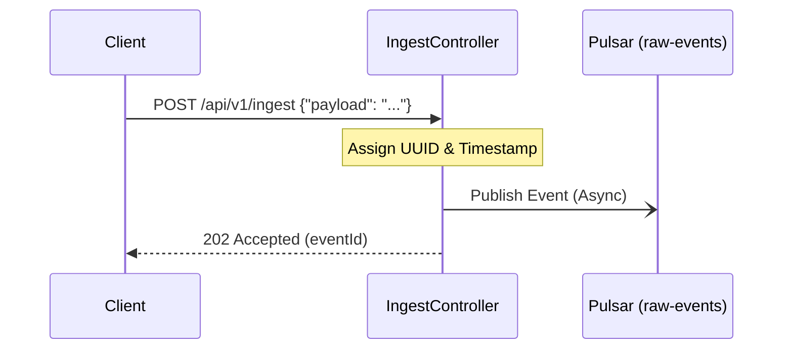
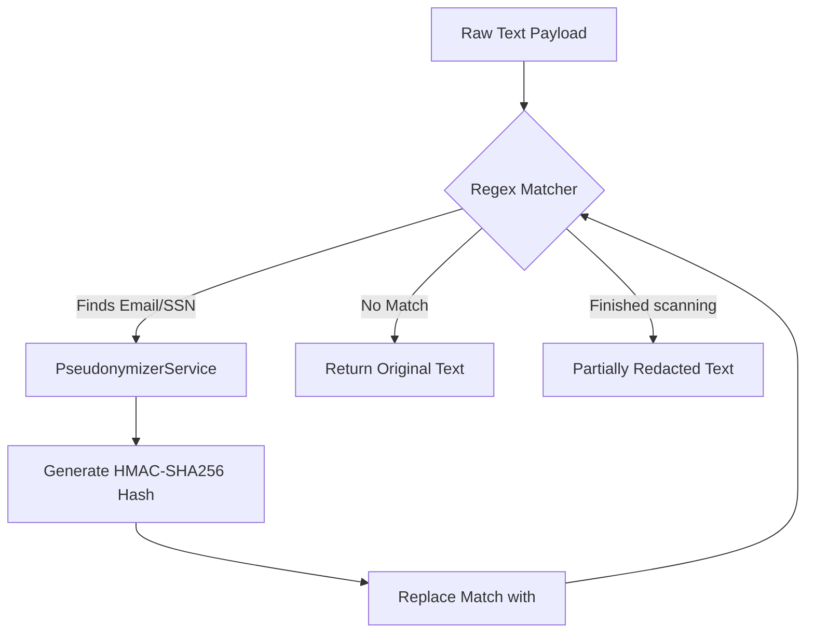
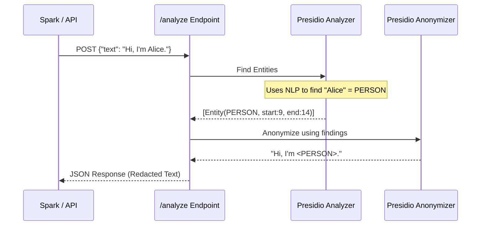
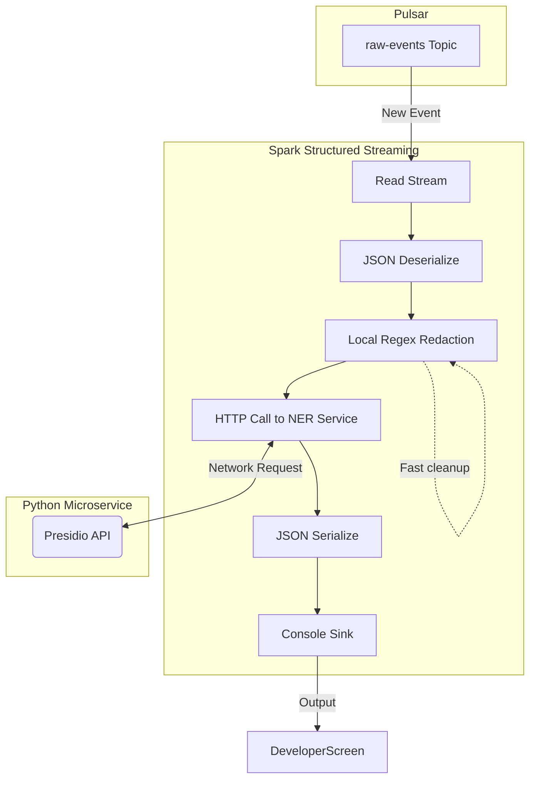

# Stream Sentinel: Beginner's Implementation Guide

Welcome to the internal workings of **Stream Sentinel**! This guide breaks down how each piece of our data pipeline works, designed specifically for beginners. We'll explore the four main components we've built so far.

## At a Glance: The Big Picture

1. **Ingest API**: The "front door". It receives data from the outside world and puts it on a conveyor belt.
2. **Pulsar Bus**: The "conveyor belt". It holds messages safely until they can be processed. (Infrastructure)
3. **Spark Job**: The "factory worker". It picks items off the conveyor belt and processes them.
4. **Lib-Detection**: The worker's "first tool". A fast, rule-based redactor.
5. **NER Service**: The worker's "smart assistant". An AI-powered service for complex redactions.

Let's dive into each module.

---

## 1. The Ingest API (`ingest-api`)

**What it is:** A Spring Boot application providing a web endpoint (REST API) for applications to send data to.

**Why it exists:** We need a secure, fast way to accept incoming events without making the sender wait for all the complex AI processing to finish.

**How it works:**

1. A client sends a `POST` request with JSON data.
2. The controller (`IngestController`) validates and converts this JSON into our internal `EventData` format.
3. Instead of processing it, the API simply hands it off to **Apache Pulsar**. This is called "asynchronous publishing".
4. The API immediately replies "Accepted" to the client.



**Key Beginner Concept:** _Decoupling_. By putting a message queue (Pulsar) between the API and the processors, the API never crashes if the processors get too busy. It just keeps adding to the queue.

---

## 2. Core Detection Library (`lib-detection`)

**What it is:** A pure Java library (a `.jar` file) containing our data models and fast, rule-based text processing logic.

**Why it exists:** We want to share our core rules between different parts of our system (like an API or a Spark job) without rewriting code. This is called keeping the system "Engine-Agnostic".

**How it works:**
The `DeterministicRedactor` uses "Regular Expressions" (Regex) to spot obvious, rigidly formatted sensitive data like Emails, Credit Cards, or Social Security Numbers (SSNs).
When it spots one, it sends it to the `PseudonymizerService`. This service uses a cryptographic hash (HMAC) to turn the email `bob@example.com` into a nonsense string like `<EMAIL:dGcjiYWmn0t3>`.



**Key Beginner Concept:** _Determinism & Salting_. The same email always turns into the same hash for the same tenant. If `bob` sends two messages, both show `dGcjiYWmn0t3`. This allows data analysts to track a user's behavior without knowing who they actually are!

---

## 3. Remote NER Service (`ner-service`)

**What it is:** A standalone Python web service powered by **FastAPI** and **Microsoft Presidio**.

**Why it exists:** Regex is fast, but it only catches strict patterns. It can't catch "My name is **John Smith** and I live in **Boston**." To catch names, places, and organizations, we need Natural Language Processing (NLP) / Machine Learning.

**How it works:**

1. It receives a string of text.
2. The `AnalyzerEngine` uses NLP models (like spaCy) to understand the sentence structure and find "Entities" (like `PERSON` or `LOCATION`).
3. The `AnonymizerEngine` takes those findings and censors the text (e.g., replacing "John Smith" with `<PERSON>`).
4. It returns both the censored text and a list of what it found.



**Key Beginner Concept:** _Microservices_. We built this in Python because Python is the undisputed king of Machine Learning. By making it a web service, our Java Spark job can ask the Python service for help over the network!

---

## 4. The Spark Streaming Job (`spark-job`)

**What it is:** The heavy lifter. A Java application using **Apache Spark Structured Streaming**.

**Why it exists:** It constantly listens to the Pulsar "conveyor belt", pulls data off, cleans it using our two tools (Lib-Detection and NER Service), and saves the clean data.

**How it works:**

1. **Read:** It sets up a continuous stream reading from the Pulsar `raw-events` topic.
2. **Process (Map):** For every single message that arrives:
   - It runs the fast Java `DeterministicRedactor` (from `lib-detection`) to strip out emails/SSNs instantly.
   - It takes that partially cleaned text and makes an HTTP network call to our Python `ner-service` to strip out names and locations.
3. **Write:** It takes the fully cleaned data and writes it to a "Sink" (currently just printing to the console, soon to be a Database).



**Key Beginner Concept:** _Streaming vs. Batch_. Instead of running once a night to process a database table (Batch), this job runs forever in an infinite loop (Streaming). As soon as an event enters Pulsar, Spark processes it milliseconds later.

---

## 5. The Audit Trail (`RedactionRecord`)

**What it is:** A structured log attached to every event detailing exactly _what_ was removed, _how_ it was removed, and _why_.

**Why it exists:** For compliance and debugging. Auditors need to know what our system is doing. If a tenant mistakenly flags a "false positive" (e.g., our system redacted a normal word thinking it was a name), having the original text mapped to the pseudonym is essential.

**How it works:**

1. Whenever the `DeterministicRedactor` or `ner-service` modifies the payload, it creates a `RedactionRecord`.
2. This record is appended to a list inside the `EventData`.
3. This list travels with the event through Spark and is eventually saved identically to the database or **Iceberg Data Lake**.

```mermaid
flowchart LR
    E[Event Payload:\n "Call Alice at 555-1234"]
    E --> R(Redactor / NER)
    R --> E2[Clean Payload:\n "Call <PERSON> at <PHONE>"]

    R -.-> A[Audit Trail List]
    A --> L1[Record: Type=PERSON, Original=Alice]
    A --> L2[Record: Type=PHONE, Original=555-1234]

    E2 --> DB[(Data Lake / DB)]
    A --> DB
```

**Key Beginner Concept:** _Extensibility & Tenant Customization_. By keeping this clear map, we can easily change _how_ things are redacted in the future. For example, Tenant A might want to use their own custom KMS key, while Tenant B might want a custom Regex rule. We just log `"source": "TENANT_A_KMS"` in the RedactionRecord, making it perfectly clear to auditors why the data looks the way it does.
